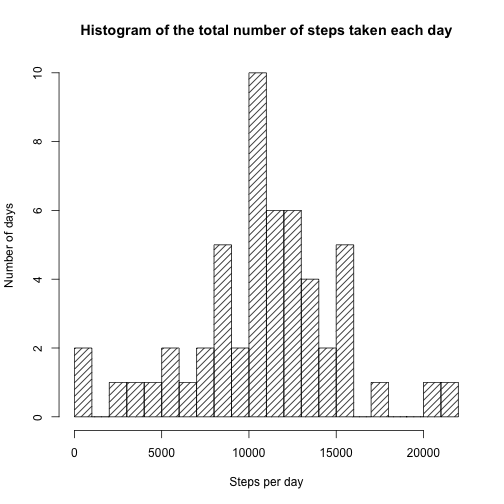
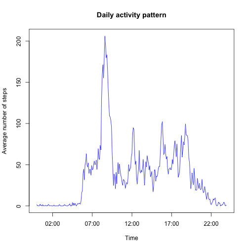
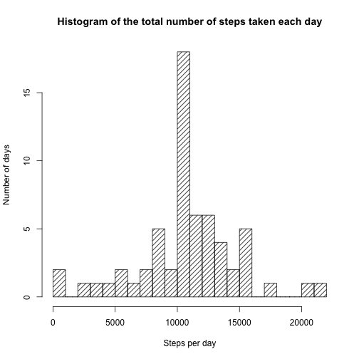
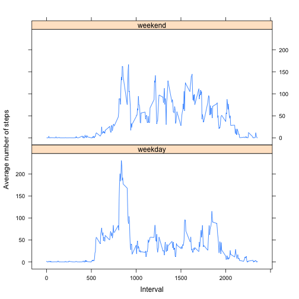

# "Reproducible Research: Peer Assessment 1"

Let's start with loading of libraries needed to this project.

```r
library(dplyr)
library(lubridate)
library(lattice)    
```

## Loading and preprocessing the data


```r
zipfile <- "activity.zip"
src <- "activity.csv"
activity_tbl <- read.csv(unz(zipfile, src),
        header=TRUE, colClasses=c("integer", "Date", "integer"))
```

## What is mean total number of steps taken per day?

Now, we define two functions which will be called for more than once. First function calculates the total number of steps taken per day, and second function draws a histogram of the total number of steps taken each day.

```r
create_daily_tbl <- function(activity) {
    activity %>%
        select(date, steps) %>%
        filter(!is.na(steps)) %>%
        group_by(date) %>%
        summarize(steps=sum(steps))
}

draw_daily_hist <- function(daily) {
    steps_breaks <- ceiling(max(daily$steps)/1000)

    hist(daily$steps, breaks=steps_breaks, density=15,
         main="Histogram of the total number of steps taken each day",
         xlab="Steps per day", ylab="Number of days")
}
```


```r
daily <- create_daily_tbl(activity_tbl)
draw_daily_hist(daily)
```

 

#### Calculate and report the mean and median of the total number of steps taken per day

```r
steps_mean   <- sprintf("%.2f", mean(daily$steps))
steps_median <- sprintf("%.2f", median(daily$steps))
```

_________________________
#### Mean number of steps is 10766.19, and median number is 10765.00.

_________________________

## What is the average daily activity pattern?


```r
create_time_series <- function(activity) {
    time_series <- activity %>%
        filter(!is.na(steps)) %>%
        mutate(series = as.factor(sprintf("%04d", interval))) %>%
        select(-interval) %>%
        group_by(series) %>%
        summarize(steps_mean=mean(steps))

    time_series$series_as_date <-
        parse_date_time(as.vector(time_series$series), "%H%M")
    time_series
}
time_series <- create_time_series(activity_tbl)

plot(time_series$series_as_date, time_series$steps_mean, type="l", col="blue",
     main="Daily activity pattern",
     xlab="Time", ylab="Average number of steps")
```

 

#### Which 5-minute interval, on average across all the days in the dataset, contains the maximum number of steps?

```r
index <- which(time_series$steps_mean == max(time_series$steps_mean))
max_start <- format(time_series$series_as_date[index], "%l:%M %p")
max_end   <- format(time_series$series_as_date[index+1], "%l:%M %p")
```

_________________________
#### Maximum number of steps has been taken in the time interval from  8:35 AM to  8:40 AM.

_________________________

## Imputing missing values
#### Calculate and report the total number of missing values in the dataset.

```r
rows_with_na <- activity_tbl[is.na(activity_tbl[,"steps"]),]
num_rows_with_na <- nrow(rows_with_na)
```

_________________________
#### Number of rows with NA is 2304.

_________________________

For imputing missing values, we substitute 5-minute NA with mean number of step taken on all other days at the same 5-minute interval.

```r
rows_with_na <- rows_with_na %>% mutate(series = as.factor(sprintf("%04d", interval)))
tmp <- merge(rows_with_na, time_series, by="series")
rows_subst_na <- tmp[,c("steps_mean", "date", "interval")]
names(rows_subst_na) <- c("steps", "date", "interval")

rows_without_na <- activity_tbl[!is.na(activity_tbl[,"steps"]),]
activity_tbl_mod <- rbind(rows_without_na, rows_subst_na) %>% arrange(date, interval)
```

We re-use two functions which were defined upper.

```r
daily <- create_daily_tbl(activity_tbl_mod)
draw_daily_hist(daily)
```

 

#### Calculate and report the mean and median total number of steps taken per day.

```r
steps_mean   <- sprintf("%.2f", mean(daily$steps))
steps_median <- sprintf("%.2f", median(daily$steps))
```

_________________________
#### Mean number of steps taken per day is 10766.19, and median number is 10766.19.

_________________________

## Are there differences in activity patterns between weekdays and weekends?


```r
trans <- function(d) {
    if (weekdays.Date(d) %in% c("Saturday", "Sunday")) "weekend" else "weekday"
}
activity_tbl_mod$day <- sapply(activity_tbl_mod$date, trans)

tms_weekdays <- with(activity_tbl_mod,
        create_time_series(activity_tbl_mod[day == "weekday",]))
tms_weekend <- with(activity_tbl_mod,
        create_time_series(activity_tbl_mod[day == "weekend",]))
tms_weekdays$day <- c("weekday")
tms_weekend$day  <- c("weekend")

time_series <- rbind(tms_weekdays, tms_weekend)
time_series$day <- as.factor(time_series$day)
```


```r
time_series$series <- sapply(time_series$series, as.character)
time_series$series <- sapply(time_series$series, as.integer)
```


```r
p <- xyplot(steps_mean ~ series | day, data = time_series,
        layout=c(1, 2), type="l",
        xlab="Interval", ylab="Average number of steps")
print(p)
```

 

#### Yes, difference in activity patterns between weekdays and weekends is clearly visible.
